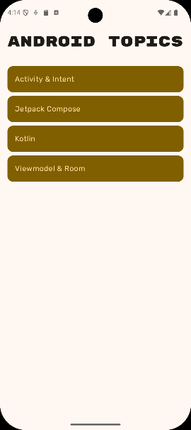
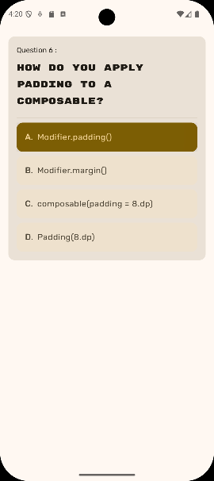
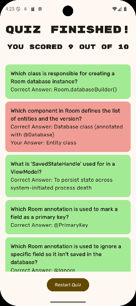
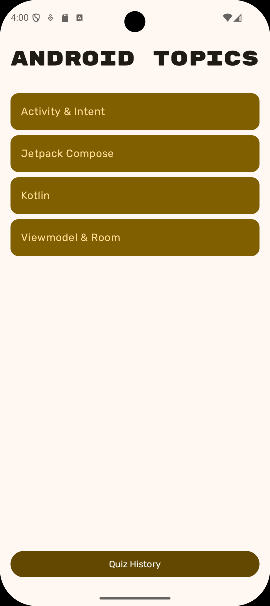
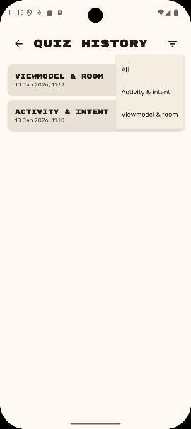
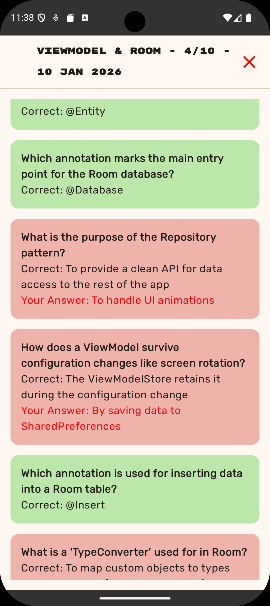

# Student Application

## IMPORTANT PLEASE READ AND MAKE NOTE

1. Remember the parent folder is the one under version control - please **do not** initialise a repository in the local folder.
2. When working on this branch please checkout branch 'main-studentapp', 

**git checkout main-studentapp**

3. Make sure to commit regularly.
4. The starting project contains JSON files in the **assets** folder. These map to Multiple Choice Questions (generated by AI). All questions follow the same format.
5. In the src / model directory - 2 kotlin classes are defined that will map to these JSON files when called correctly.
6. The project was created with Android Otter 2, Gradle 9.2.1 and targets/compiles to SDK 36

---
***Folder Explanation***

#### REQUIRED WORK

Please note that the supplied screenshots are indicative - the choice of themes, styles, fonts and UI sequences are your own decisions.

#### MINIMUM REQUIREMENTS:

1. The application should present the user with a list of topics that can be quizzed on.
2. Selecting a topic will present a Question Page (1 question at a time)
3. The quiz should be 10 questions in length
4. On completion a summary page should be presented detailing the score and offering the option to restart (back to the home page)

|          **Screen 1**           |          **Screen 2**           |          **Screen 3**           |
|:-------------------------------:|:-------------------------------:|:-------------------------------:|
|  |  |  |

#### EXTENSIONS 1

1. The Summary Page as well as displaying the score, will include a list of all the questions answered. 
2. These should be colour coded - and for wrong answers provide the correct answer

|      **Revised Screen 3**       |
|:-------------------------------:|
|  | 

#### EXTENSIONS 2

1. All tests should be stored in a ROOM Database and be able to be accessed via a new HISTORY feature.
2. On the list page, the test should be displayed as TOPIC / DATE / SCORE
3. Include a filter option - allowing for the list to display based on Topic
4. Selecting one will display the submitted questions and answers - colour coded on whether they were answered correctly or not.

|      **Revised Screen 1**       |          **Screen 4**           |          **Screen 5**           |
|:-------------------------------:|:-------------------------------:|:-------------------------------:|
|  |  |  |

##### Further Information:

Please look to follow good practice and guidelines - and use this as part of your reflective report.
Indicatively this app is likely to contain:

- Styles, themes and fonts
- Lazy List
- Back Stack Management
- Nav Host
- View Model
- Serialization
- Flow or LiveData
- ROOM (Database)

---
### Please use the Discussion Forum on the VLE for questions. ###

